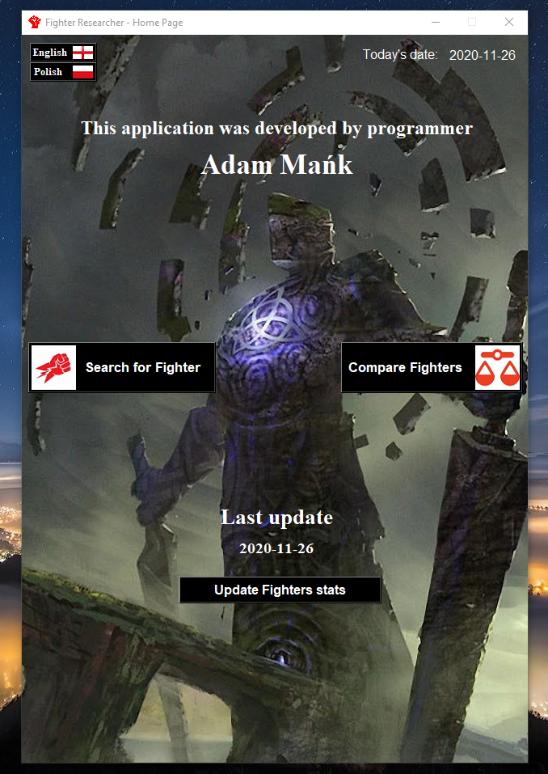
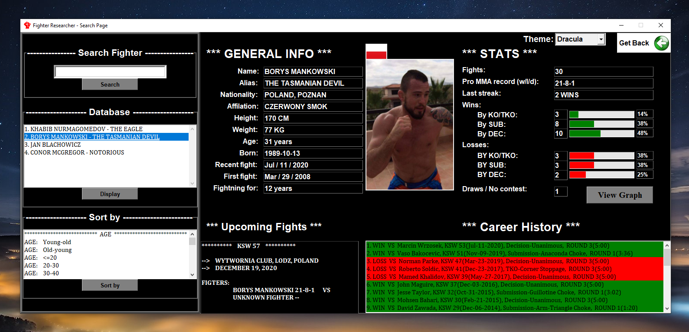
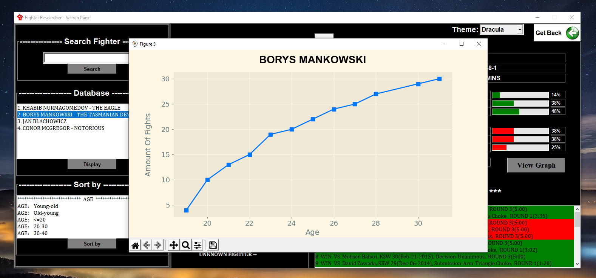
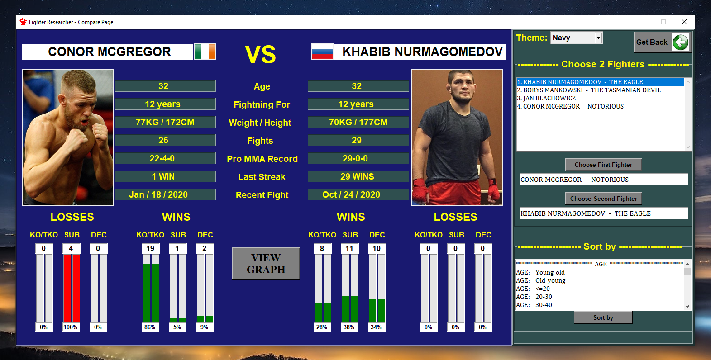
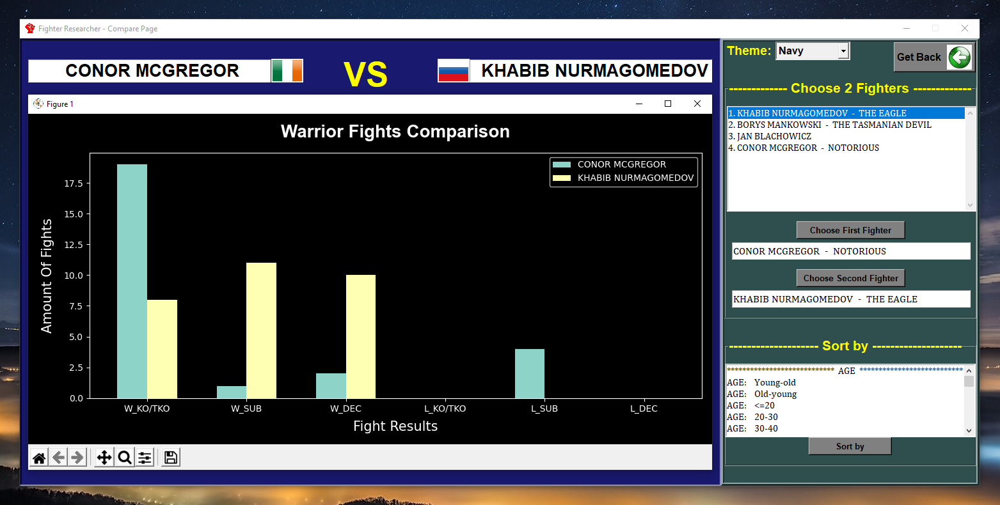

# Fighter Researcher

## Preface

       This GUI app originally can find any fighter that we are looking for
    just by typing his name in "search_page" and return his detailed profile  
    (photo, personal informations, MMA statistics, fights that he foughts, etc...).

    What's more, it gives us the ability to compare them! Nice diagrams are also in game.

    Unfortunatelly, due to the site's rights, I cannot share the full searching algorithm.
    This means that application I'm posting here is a santized version of the original one.

    I encourage You guys to have a look on a video & photos to see how it is working 
    in a real time (presentation dir).
    All requirements were specified for the original one.
 

## Requirements

1. Python == 3.8
2. matplotlib == 3.3.1
3. selenium == 3.141.0
4. numpy == 1.19.3
5. SQLite

## Run app

If You already have installed those things, in the project root simply run:

>_**python main.py**_  

or
>_**python3 main.py**_  

depending on your Python system configurations.
___
You can also initialize project in the virutal env by pipenv:

>_**pipenv install**_   
>_**pipenv run python main.py**_   

## Presentation of the app

#### Home Page ####  
  

#### Search Page ####  

   

#### Compare Page ####  

